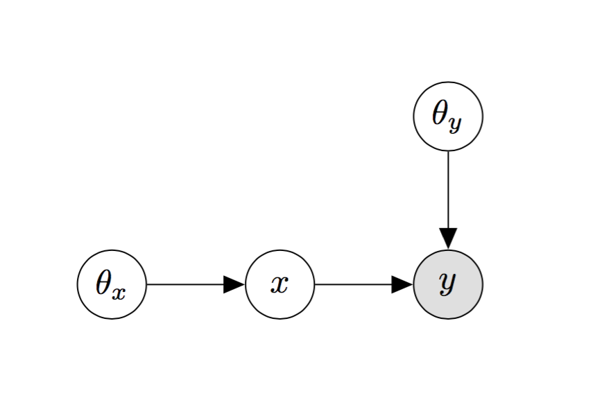

# Introduction
## Problem formulation
The true network structure is drawn from $P(A|\theta)$. We will later constrain this distribution to belong to the exponential random graph models family. The observations of the network are supposed to be noisy. The network structure and the observations are related to one another by $P(data|A,\theta)$. Our aim is to infer the parameters $\theta$ through the posterior distribution $P(\theta|data)$. $$P(\theta|data)\propto \sum_AP(data|A,\theta)P(A|\theta)P(\theta)$$ This optimisation problem is hard since it is often non convex, might have many local maxima and no analytical solutions. In our model, as illustrated on the figure below, we have two unknowns: the latent variables and the parameters. 

```{r pressure, echo=FALSE, out.width = '50%'}

```


## Models

### Bernouilli
Let $\rho$ be the probability of an edge in any position. Then, the Bernouilli model is defined by:
$$P(A|\rho)=\prod_{i<j}\rho^{A_{i,j}}(1-\rho)^{1-A_{i,j}}$$

### Generalisation 
$$P(A=a|\theta)=exp\left(\sum_{i=1}^k{\theta_iT_i(a)-c(\theta)}\right)$$

# Inference for the Bernouilli model
## Expectation Maximization algorithm

**E-step**

The expectation step consists in updating the posterior probabilities with the previous estimates of the parameters. 

$$q^{(t)}(A)=\frac{p(A,\hat{\theta}^{(t)}|data)}{\sum_A{p(A,\hat{\theta}^{(t)}|data)}}$$
**M-step**

The maximisation step consists in solving the tractable optimisation problem: 
$$\sum_Aq^{(t)}(A)\nabla_\theta log~{p(A,\hat{\theta}^{(t+1)}|data)}=0$$
With the Bernouilli model, the maximisation step is tractable, since we have: 
$$\begin{split}p(A,\theta|data)&=\frac{1}{p(data)}\left(\alpha^{\sum_{k}Y_{i,j}^{(k)}}(1-\alpha)^{N_{i,j}-\sum_kY_{i,j}^{(k)}}\right)^{A_{i,j}}\left(\beta^{\sum_kY_{i,j}^{(k)}}(1-\beta)^{N_{i,j}-\sum_kY_{i,j}^{(k)}}\right)^{1-A_{i,j}}p(A)p(\theta)\end{split}$$


## Experiments and results

### Tests on simulated data

**Dataset**

In this section, we propose to validate the model’s estimates using a synthetic dataset for which the ground truth network and the noisy observations are generated via a predefined probabilistic model. We simulate a network with `r n=50` $n=$ `r n` vertices, and we set $\rho=$ `r rho=0.1` `r rho`. The noisy observations are then simulated for $k=$ `r k=10` `r k` days, with true positive rate $\alpha=$ `r alpha=0.6` `r alpha` and false positive rate $\beta=$ `r beta=0.009` `r beta`. Our stopping criterium is met when the absolute value of the difference of all parameter values after an iteration is less than $\epsilon=$ `r epsilon=0.001` `r epsilon`. 

```{r echo=FALSE, results='hide',fig.keep='none'}
   # generate ground truth network
  output <- sampleErdosRenyi(n,rho)
  g <- output[[2]]
  A <- output[[1]]

  # generate noisy observations of the ground truth network
  E <- interact(A,alpha,beta, n,k)
  simulation <- EM(alpha0=0.4, beta0=0.02, rho0=0.15, n, k, E)
```

**Results**

In this setting, the stopping criterium is met after `r simulation[5]` iterations. The figure below, shows the comparison of the ground truth network with the inferred network (obtained by thresholding the posterior probabilities at $t=$ `r t=0.5` `r t`), where the size of the nodes is proportional to their degree. 

```{r echo=FALSE}
  out=analyse_results(t)
```


$\begin{tabular}{|c|c|}\hline Precision & `r out$Precision` \\ \hline Recall & `r out$Recall` \\ \hline Accuracy & `r out$Accuracy` \\ \hline F-measure & `r out$F_measure` \\ \hline\end{tabular}$

The figure below shows the influence of the number of observations $k$ on the performances of the algorithm. 

```{r echo=FALSE}
F_measure_plot(20,n)
```


### Tests on real data

# Extension to other Exponential Random Graph Models

TO DO: explain why we will not use the EM algorithm.

The aim of this section is to discuss how a bayesian estimation of the parameters $\theta=\{\theta_x, \theta_y\}$ can be performed. In our case, we cannot use a vanilla Metropolis Hastings algorithm with $p(\theta|y)$ as a target distribution, for the following reasons:

* The normalising constant $Z(\theta)$ is intractable. This problem is would also arise in the case where the network is completely observed. 

* The likelihood appearing in the acceptance ratio is intractable, since we would have to sum over all the states that the hidden variable $x$ can take, with $x$ a binary vector of size $n$.


$$\alpha_{MH}(\theta,\theta')= 1 \land \frac{p(y|\theta')p(\theta')q(\theta|\theta')}{p(y|\theta)p(\theta)q(\theta'|\theta)}$$

$$p(y|\theta)=\sum_xp(y|\theta,x)p(x|\theta) $$

## Experiments

