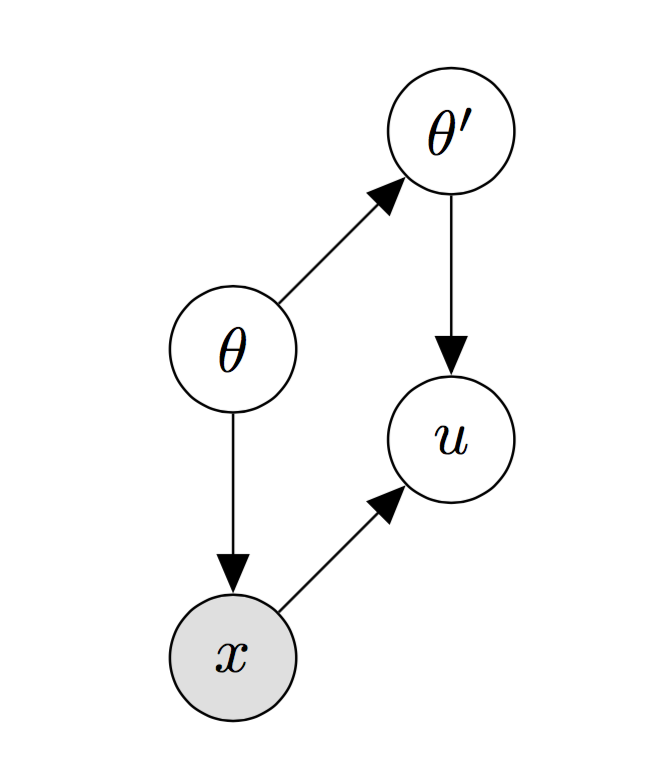

# Introduction
## Problem formulation and motivation
The true network structure is drawn from $P(A|\theta_A)$. We will later constrain this distribution to belong to the exponential random graph models family. The observations of the network are supposed to be noisy. The network structure and the observations are related to one another by $P(data|A,\theta_Y)$. Our aim is to infer the parameters $\theta=\{\theta_A,\theta_Y\}$ through the posterior distribution $P(\theta|data)$. $$P(\theta|data)\propto \sum_AP(data|A,\theta_Y)P(A|\theta_A)P(\theta)$$ This optimisation problem is hard since the function is often non convex, might have many local maxima and no analytical solutions. In our model, as illustrated on Figure \ref{fig:graph_model}, we have two unknowns: the latent variables and the parameters. We also suppose that the underlying network is probed $k$ times.  

```{r pressure, echo=FALSE, fig.pos="H", out.width = '65%',fig.cap="\\label{fig:graph_model}Graphical Model"}
knitr::include_graphics("GM2.png")

```

In this report, we consider unweighted undirected networks, characterised by an $n \times n$ symmetric adjacency matrix $A$, having elements $A_{i,j} = 1$ if nodes $i$ and $j$ are connected by an edge and $0$ otherwise. Similarly, we note $Y_{i,j}^{(k)}$ the edge measurement between node $i$ and $j$ at time $k$.

## Network models

### Bernoulli (Erdős–Rényi) model

The Bernoulli or Erdős–Rényi model is one of the simplest models for random networks. Starting with $n$ isolated vertices, for any pair of nodes $(i, j)$ an edge is added with probability $\rho>0$. This step is repeated for the $\binom{n}{2}=n(n-1)/2$ pairs of nodes. This network is determined by the number of nodes $n$, the probability of edge formation $\rho$ and the total number edges $m$ and can be expressed as either $G(n,\rho)$ or $G(n,m)$. We will use the former notation. Since there are $\binom{n}{2}$ pairs of nodes in the network, the expected number of edges is given by $\binom{n}{2}\rho$. Similarly, the expected number of 2-stars is $\binom{n}{3}\rho^2$ and the expected number of triangles is $\binom{n}{3}\rho^3$. The degree $deg(j)$ of a node $j$ is defined as the number of edges connected to it. Given the adjacency matrix $A$, this is
$$ deg(j)=\sum_{i}{A_{i,j}}.$$

The average degree of the graph is then given by the average of the individual nodes degrees. For a Bernoulli graph, the probability that a given node has degree $d$ is the product of $a)$ the probability that $d$ links are present, $b)$ the probability that the remaining potential links are missing, and $c)$ the number of combinations in which we can select the $d$ links out of the potential $n-1$. Hence, they follow a Binomial distribution:

$$ P(deg(j)=d)=p_d=\binom{n-1}{d}\rho^d(1-\rho)^{n-1-d} $$

with expected degree $\rho(n-1)$. For large $n$ and small $\rho$, this distribution can be approximated by a Poisson distribution with parameter $\rho(n-1)$. Due to all pairs of nodes having the same probability of edge formation, the Erdős–Rényi model is not appropriate to represent social networks, where edges tend to form between nodes which already share common connections.\


### ERGM model

Exponential random graph models are a family of probability distributions on graphs. Let $\mathcal{A}_n$ be the set of all graphs on $n$ vertices, and consider the following model, where $\theta_i,~i=1,2,...,m$ are real valued parameters, and $T_i,~i=1,2,...,m$ are real valued statistics defined on $\mathcal{A}_n$. Possible sufficient statistics for such models are the degree of the vertices, the number of edges, the number of triangles, or the number of connected components.

$$P(A=a|\theta)=\frac{1}{Z(\theta)}\exp\left(\sum_{i=1}^m{\theta_iT_i(a)}\right)$$
```{r echo=FALSE, fig.align='center', fig.pos="H", out.width = '60%',out.height='60%',fig.cap="\\label{fig:triangle}Example of edge, 2-star, 3-star and triangle"}


```
# Methods
## Inference for the Bernoulli model

Since the underlying matrix $A$ is symmetric, we consider the lower triangular part of the matrix only and simulate the interactions for each day $k$ as edge observations $Y_{i,j}^{(k)}$ for entries $i<j$. These observations are assumed to be independent Bernoulli random variables conditioned on $A_{i,j}$. Given that the prior probability for a random edge is $\rho$, the prior model for the network is 
$$P(A|\rho)=\prod_{i<j}\rho^{A_{i,j}}(1-\rho)^{1-A_{i,j}}.$$

The data model is specified by $P(\mbox{data}|A, \theta)$, where $data$ corresponds to the observed $Y_{i,j}^{(k)}$. To simplify the notations, we let $E_{i,j}=\sum_kY_{i,j}^{(k)}$. Applying Bayes' theorem,
$$P(A,\theta|\mbox{data})=\frac{P(\mbox{data}|A,\theta)P(A)P(\theta)}{P(\mbox{data})}.$$

Our aim is to find the parameters $\theta$ that fix the relationship between the network and the data in order to then estimate the actual network structure. Summing over all the possible network structures $A$, we obtain the likelihood function
$$P(\theta|\mbox{data})=\sum_{A}{P(A,\theta|\mbox{data})}$$

which we want to maximise to find the best estimates of $\theta$ given the observed data. Taking logarithms in both sides and making use of the Jensen inequality, we get
$$\begin{aligned}
\log P(\theta|\mbox{data}) &= \log \sum_{A}{P(A,\theta|\mbox{data})} \\
                          &= \log \sum_{A} q(A)\frac{P(A,\theta|\mbox{data})}{q(A)} \\
                          &\geq \sum_{A} q(A) \log \frac{P(A,\theta|\mbox{data})}{q(A)},
\end{aligned}$$

where $q(A)$ is any probability distribution over networks satisfying $\sum_{A}q(A)=1.$ The right hand size of the equation is maximised in the case of equality, that is, when 
$$q(A)=\frac{P(A,\theta|\mbox{data})}{ \sum_{A}P(A,\theta|\mbox{data})}.$$

Notice that $q(A)=P(A|\mbox{data}, \theta)$. We will use this result in order to estimate the parameters $\theta$ and the true underlying network $A$  by employing an EM algorithm. We now define the true-positive rate $\alpha$ and the false-positive rate $\beta$ respectively as the probabilities of observing an edge when it actually exists and observing it when it does not exist. We assume that the priors for $\alpha$, $\beta$ and $\rho$ are uniform in the interval [0,1]. Then,


$$\begin{aligned}
P(\mbox{data}|A, \theta)
&=\prod_{i<j}\left(\alpha^{\sum_{k}Y_{i,j}^{(k)}}(1-\alpha)^{N_{i,j}-\sum_kY_{i,j}^{(k)}}\right)^{A_{i,j}}\left(\beta^{\sum_kY_{i,j}^{(k)}}(1-\beta)^{N_{i,j}-\sum_kY_{i,j}^{(k)}}\right)^{1-A_{i,j}} \\
&=\prod_{i<j}\left(\alpha^{E_{i,j}}(1-\alpha)^{N_{i,j}-E_{i,j}}\right)^{A_{i,j}}\left(\beta^{E_{i,j}}(1-\beta)^{N_{i,j}-E_{i,j}}\right)^{1-A_{i,j}}.
\end{aligned}$$

Combining this equation with the prior model for the network involving $\rho$ that we defined above, we obtain
$$\begin{aligned}
P(A,\theta|\mbox{data})
&=\frac{1}{P(data)}\prod_{i<j}\left(\alpha^{E_{i,j}}(1-\alpha)^{N_{i,j}-E_{i,j}}\right)^{A_{i,j}}\left(\beta^{E_{i,j}}(1-\beta)^{N_{i,j}-E_{i,j}}\right)^{1-A_{i,j}} p(A)p(\theta) \\
&=\frac{1}{P(data)}\prod_{i<j}\left(\rho \alpha^{E_{i,j}}(1-\alpha)^{N_{i,j}-E_{i,j}}\right)^{A_{i,j}}\left((1-\rho)\beta^{E_{i,j}}(1-\beta)^{N_{i,j}-E_{i,j}}\right)^{1-A_{i,j}}.
\end{aligned}$$

## The EM (expectation-maximization) algorithm

**E-step**

The expectation step consists in updating the posterior probabilities with the previous estimates of the parameters. 

$$q^{(t)}(A)=\frac{p(A,\hat{\theta}^{(t)}|\mbox{data})}{\sum_A{p(A,\hat{\theta}^{(t)}|\mbox{data})}}$$
**M-step**

The maximisation step consists in solving the tractable optimisation problem: 
$$\sum_Aq^{(t)}(A)\nabla_\theta \log~{p(A,\hat{\theta}^{(t+1)}|\mbox{data})}=0$$
With the Bernoulli model, the maximisation step is tractable, since we have: 
$$\begin{split}P(A,\theta|\mbox{data})&=\frac{1}{P(\mbox{data})}\prod_{i<j}\left(\rho \alpha^{E_{i,j}}(1-\alpha)^{N_{i,j}-E_{i,j}}\right)^{A_{i,j}}\left((1-\rho)\beta^{E_{i,j}}(1-\beta)^{N_{i,j}-E_{i,j}}\right)^{1-A_{i,j}}\end{split}.$$

To simplify the notations, let $Q_{i,j}=P(A_{i,j}=1|data,\theta)=\sum_{A}{q(A)A_{i,j}}.$

$$\begin{pseudocode}[shadowbox]{EM}{\alpha^{(0)},\beta^{(0)}, \rho^{(0)}}
(\alpha,\beta, \rho) \leftarrow (\alpha^{(0)},\beta^{(0)}, \rho^{(0)}) \\
\\ 
\WHILE \mbox{stopping criterion is not met} \DO 
\BEGIN
\mbox{E step:}\\ 
~~~Q_{i,j} \leftarrow \frac{\rho\alpha^{E_{i,j}}(1-\alpha)^{N-E_{i,j}}}{\rho\alpha^{E_{i,j}}(1-\alpha)^{N-E_{i,j}}+(1-\rho)\beta^{E_{i,j}}(1-\beta)^{N-E_{i,j}}}\\
\mbox{M step:} \\
\BEGIN
~~~\alpha \leftarrow \frac{\sum_{i<j}E_{i,j}Q_{i,j}}{N\sum_{i<j}Q_{i,j}} \\
~~~\beta \leftarrow \frac{\sum_{i<j}E_{i,j}(1-Q_{i,j})}{N\sum_{i<j}(1-Q_{i,j})} \\
~~~\rho \leftarrow \frac{1}{{n \choose 2}}\sum_{i<j}Q_{i,j}
\END
\END \\ 
\RETURN{Q,\alpha,\beta, \rho}
\end{pseudocode}$$

## Inference for the ERGM model


The aim of this section is to discuss how a bayesian estimation of the parameters $\theta=\{\theta_A, \theta_Y\}$ can be performed. In our case, we cannot use a vanilla Metropolis Hastings algorithm with $p(\theta|Y)$ as a target distribution, for the following reasons:

* The normalising constant $Z(\theta)$ is intractable. This problem is would also arise in the case where the network is completely observed. 

* The likelihood appearing in the acceptance ratio is intractable, since we would have to sum over all the states that the hidden variable $A$ can take, with $A$ a binary vector of size $n$.


$$\alpha_{MH}(\theta,\theta')= 1 \land \frac{p(Y|\theta')p(\theta')q(\theta|\theta')}{p(Y|\theta)p(\theta)q(\theta'|\theta)}$$

$$p(Y|\theta)=\sum_Ap(Y|\theta,A)p(A|\theta) $$

## Pseudolikelihood estimation
## Markov Chain Monte Carlo Maximum Likelihood estimation (MCMC-MLE)
## The Exchange Algorithm
The exchange algorithm (\cite{murray2012mcmc}) falls within the class of *auxiliary variable approaches*, which consist in introducing an auxiliary variable $u$ with a well-chosen conditional density $f(u|\theta,x)$ so that the intractable normalizing function cancels out in the Metropolis-Hastings acceptance probability. In the exchange algorithm, the auxiliary variable follows $h(u|\theta^*)/Z(\theta^*)$. Therefore the augmented target is:

$$\begin{split}\pi(\theta,\theta^*,u|x) & \propto p(\theta)p(x|\theta)q(\theta^*|\theta)p(u|\theta^*) \\ & = p(\theta)\frac{h(x|\theta)}{Z(\theta)}q(\theta^*|\theta)\frac{h(u|\theta^*)}{Z(\theta^*)}\end{split}$$


```{r echo=FALSE, fig.align='center', fig.pos="H", out.width = '20%',out.height='20%',fig.cap="\\label{fig:triangle}The augmented model"}


```
## The Double Metropolis-Hastings algorithm

# Results

## Tests on simulated data

**Dataset**

In this section, we propose to validate the model’s estimates using a synthetic dataset for which the ground truth network and the noisy observations are generated via a predefined probabilistic model. We simulate a network with `r n=100` $n=$ `r n` vertices, and we set $\rho=$ `r rho=0.1` `r rho`. The noisy observations are then simulated for $k=$ `r k=5` `r k` days, with true positive rate $\alpha=$ `r alpha=0.6` `r alpha` and false positive rate $\beta=$ `r beta=0.009` `r beta`. Our stopping criterion is met when the absolute value of the difference of all parameter values after an iteration is less than $\epsilon=$ `r epsilon=0.001` `r epsilon`. 

```{r echo=FALSE, results='hide',fig.keep='none',fig.pos="H"}
   # generate ground truth network
  output <- sampleErdosRenyi(n,rho)
  g <- output[[2]]
  A <- output[[1]]

  # generate noisy observations of the ground truth network
  E <- interact(A,alpha,beta, n,k)
  simulation <- EM(alpha0=0.4, beta0=0.02, rho0=0.15, n, k, E)
```

**Results**

In this setting, the stopping criterion is met after `r simulation[5]` `r nIter=simulation[5]` iterations. The figure below, shows the comparison of the ground truth network with the inferred network (obtained by thresholding the posterior probabilities at $t=$ `r t=0.5` `r t`), where the size of the nodes is proportional to their degree.


```{r echo=FALSE, fig.pos="H",fig.cap="\\label{fig:comparison}(left) Ground truth underlying network (right) Inferred underlying network"}
  out=analyse_results(t,n,k,rho,alpha,beta)
```


```{r echo=FALSE,fig.pos="H",fig.height = 2,fig.width=8,fig.align = "center",fig.cap="\\label{fig:figs} Convergence of the parameter estimates"}

m1<-simulation[[6]][c(1:simulation[[5]]),]
par(mfrow = c(1, 3))
plot(m1[,1], type="l",xlab="iteration number",ylab=expression(alpha))
plot(m1[,2],type="l",xlab="iteration number",ylab=expression(beta))
plot(m1[,3],type="l",xlab="iteration number",ylab=expression(rho))
```


$$
\centering\begin{tabular}{|c|c|}\hline Precision & `r out$Precision` \\ \hline Recall & `r out$Recall` \\ \hline Accuracy & `r out$Accuracy` \\ \hline F-measure & `r out$F_measure` \\ \hline\end{tabular}$$

The figure below shows the influence of the number of repeated observations $k$ on the performances of the algorithm. 

```{r echo=FALSE,fig.pos="H",fig.height = 4,fig.width=10,fig.align = "center",fig.cap="\\label{fig:figs}Performance metrics versus the number of repeated observations k"}
par(mfrow=c(1,2))
F_measure_plot(20, n=100)
F_measure_networksize(n=100)
```

# Discussion

\nocite{
morris2008specification,
eagle2006reality,
everitt2012bayesian,
korber2018bayesian,
jin2013bayesian,
newman2018network,
koskinen2010analysing,
everitt2017marginal,
murray2012mcmc,
hunter2006,
park2018bayesian,
strauss1990pseudolikelihood,
snijders2002markov,
schmid2017exponential}
